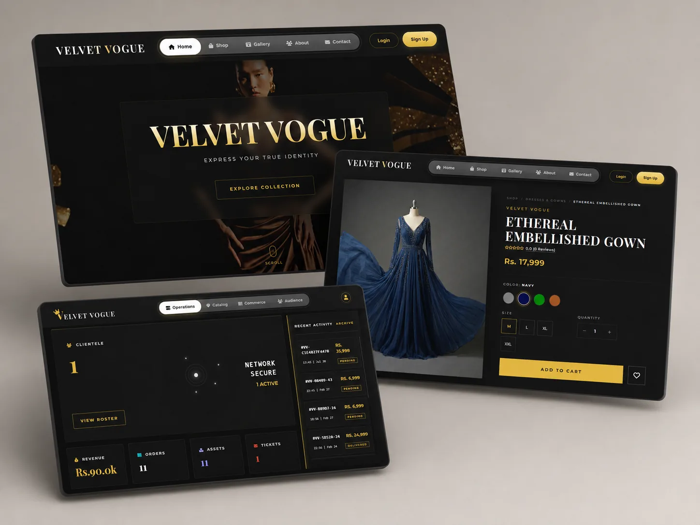

<div align="center">

# Velvet Vogue

### Full-Stack Fashion E-Commerce Platform

A responsive e-commerce application with a complete customer shopping experience and an administrator dashboard.

<br>

[](https://velvetvogue.gamer.gd)

</div>

---



## Overview

Velvet Vogue is a full-stack fashion e-commerce platform built with PHP and MySQL.

Customers can browse products, manage accounts, save items, use coupons and place orders. Administrators can manage products, categories, inventory, customers, orders, reviews, inquiries and store settings.

## Features

### Customer Experience

- Registration, login and persistent authentication
- Product catalogue with search, filtering and sorting
- Product variants for size, colour, price and stock
- Shopping cart and wishlist
- Coupon discounts
- Cash-on-delivery checkout
- Order history, invoices and tracking
- Product reviews and customer inquiries
- Profile and delivery-address management
- Responsive desktop and mobile interface
- Interactive custom 404 page

### Administrator Dashboard

- Dashboard statistics and store overview
- Product, category and variant management
- Product image and inventory management
- Customer and account management
- Order processing and status updates
- Coupon management
- Review moderation
- Inquiry management
- Store configuration

## Tech Stack

**Frontend**

`HTML5` · `CSS3` · `JavaScript` · `Bootstrap` · `GSAP`

**Backend**

`PHP` · `PDO` · `MySQL`

**Development**

`Git` · `GitHub` · `XAMPP` · `phpMyAdmin`

## Security and Quality

The application includes:

- Prepared PDO statements
- Password hashing
- CSRF and same-origin request protection
- Secure session handling
- Signed persistent-login cookies
- Role-based administrator access
- Server-side input validation
- Image type, size and path validation
- Rate limiting for sensitive actions
- Security headers and production checks
- Command-line security self-tests

## Local Setup

### Requirements

- PHP 8.1 or newer
- MySQL or MariaDB
- Apache or another PHP-compatible web server
- PHP extensions:
  - `pdo_mysql`
  - `mbstring`
  - `fileinfo`
  - `dom`
  - `json`
  - `openssl`

### Installation

1. Clone the repository:

```bash
git clone https://github.com/SafanDev/velvet-vogue.git